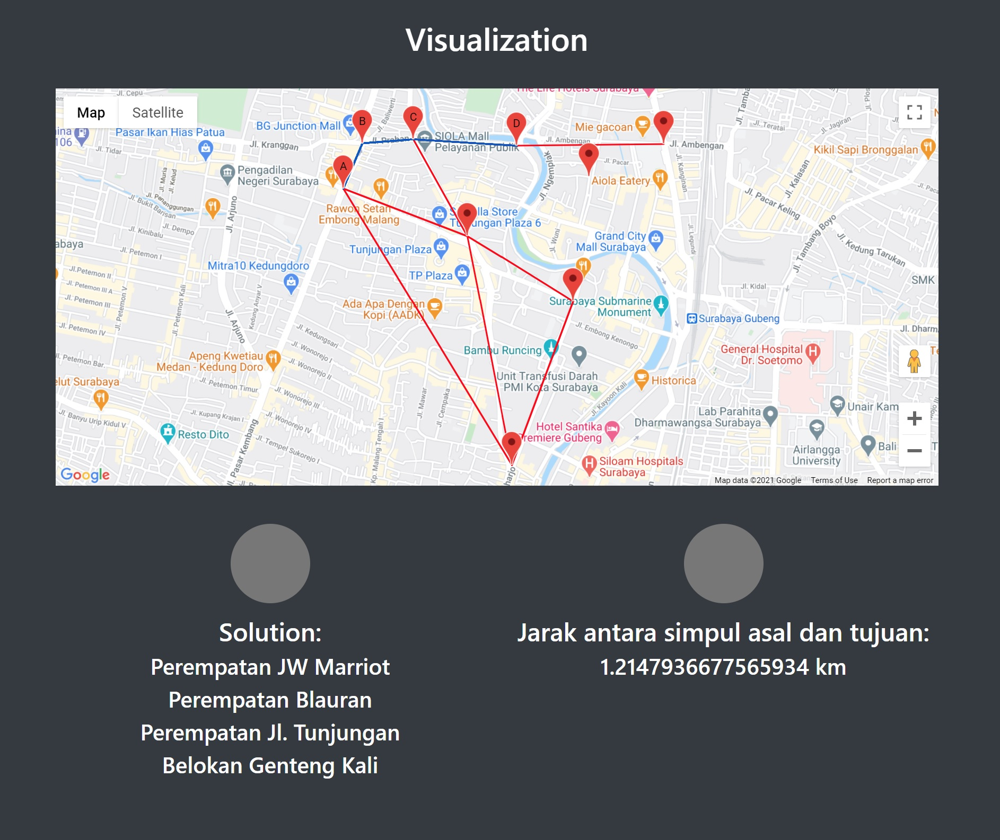

# Tugas Kecil 3 Strategi Algoritma IF2211
> Implementasi Algoritma A* untuk Menentukan Lintasan Terpendek

## Daftar Isi
* [Kontributor](#kontributor)
* [Penjelasan](#penjelasan)
* [Spesifikasi](#spesifikasi)
* [Requirements](#requirements)
* [Cara Pengunaan](#cara_penggunaan)
* [Alur Program](#alur_program)
* [Contoh Visualisasi](#contoh_visualisasi)
* [Laporan](#laporan)

## Kontributor
* Fabian Savero Diaz Pranoto (13519140)
* Fadel Ananda Dotty (13519146)

## Penjelasan
Algoritma A* (atau A star) dapat digunakan untuk menentukan lintasan terpendek dari suatu titik ke titik lain. Pada tugas kecil 3 ini, diminta menentukan lintasan terpendek berdasarakan peta Google Map jalan-jalan di kota Bandung. Dari ruas-ruas jalan di peta dibentuk graf. Simpul menyatakan persilangan jalan atau ujung jalan. Asumsikan jalan dapat dilalui dari dua arah. Bobot graf menyatakan jarak (m atau km) antar simpul. Jarak antar dua simpul dapat dihitung dari koordinat kedua simpul menggunakan rumus jarak Euclidean (berdasarkan koordinat) atau dapat menggunakan ruler di Google Map, atau cara lainnya yang disediakan oleh Google Map.

## Spesifikasi
1. Program menerima input file graf (direpresentasikan sebagai matriks ketetanggaan berbobot), jumlah simpul minimal 8 buah.
2. Program dapat menampilkan peta melalui Google Maps.
3. Program menerima input simpul asal dan simpul tujuan.
4. Program dapat menampilkan lintasan terpendek beserta jaraknya antara simpul asal dan simpul tujuan.

## Requirements
1. Flask

## Cara Penggunaan
Sebaiknya menginstall flask pada virtual environment saja. Untuk membuat virtual environment sebagai berikut:
```bash
pip install virtualenv
python -m venv env
```
Untuk menyalakan virtual environment, dari directory utama proyek ini:
```bash
source env/Scripts/activate
```
Setelah itu baru dapat menginstall flask dengan command sebagai berikut:
```bash
pip install flask
```
Untuk menyalakan program, masukkan command sebagai berikut:
```bash
export FLASK_APP=src/main.py
flask run
```

## Alur Program
1. Program akan meminta input file.
```bash
Masukkan filename:
```
2. Apabila input file sudah benar, akan memunculkan daftar node dan informasinya. Contoh:
```bash
Daftar Node: 
Name: Jl. Ahmad Yani
Latitude: -6.990485
Longitude: 110.423839
Neighbours: Jl. Pahlawan, Simpang Lima

Name: Jl. Pahlawan
Latitude: -6.997269
Longitude: 110.419265
Neighbours: Jl. Ahmad Yani, Jl. Imam Barjo, Jl. Veteran, Simpang Lima

Name: Jl. Imam Barjo
Latitude: -6.993382
Longitude: 110.42167
Neighbours: Jl. Pahlawan, Jl. Mentri Supeno

Name: Jl. Veteran
Latitude: -6.995821
Longitude: 110.414089
Neighbours: Jl. Pahlawan, Jl. Dokter Kariadi

Name: Jl. Dokter Kariadi
Latitude: -6.993414
Longitude: 110.413746
Neighbours: Jl. Veteran, Jl. Mentri Supeno

Name: Jl. Mentri Supeno
Latitude: -6.993265
Longitude: 110.419242
Neighbours: Jl. Imam Barjo, Jl. Dokter Kariadi, Jl. Pandanaran II

Name: Jl. Pandanaran II
Latitude: -6.991625
Longitude: 110.4201
Neighbours: Jl. Mentri Supeno, Jl. Pandanaran

Name: Jl. Pandanaran
Latitude: -6.988792
Longitude: 110.420099
Neighbours: Jl. Pandanaran, Simpang Lima

Name: Simpang Lima
Latitude: -6.989985
Longitude: 110.422203
Neighbours: Jl. Ahmad Yani, Jl. Pahlawan, Jl. Pandanaran
```
3. Flask akan berjalan pada http://127.0.0.1:5000/
```bash
* Running on http://127.0.0.1:5000/ (Press CTRL+C to quit)
```
4. Jalankan pada browser
5. Masukkan input lokasi awal dan tujuan
```bash
Masukkan rute lokasi yang ingin dicari:
Masukkan lokasi awal: Jl. Veteran
Masukkan lokasi tujuan: Simpang Lima
```
6. Akan ditampilkan visualisasi pada browser yang sudah dibuka.

## Contoh Visualisasi


## Laporan
Laporan dapat diakses [di sini](./doc/Tucil3_13519140.pdf)
